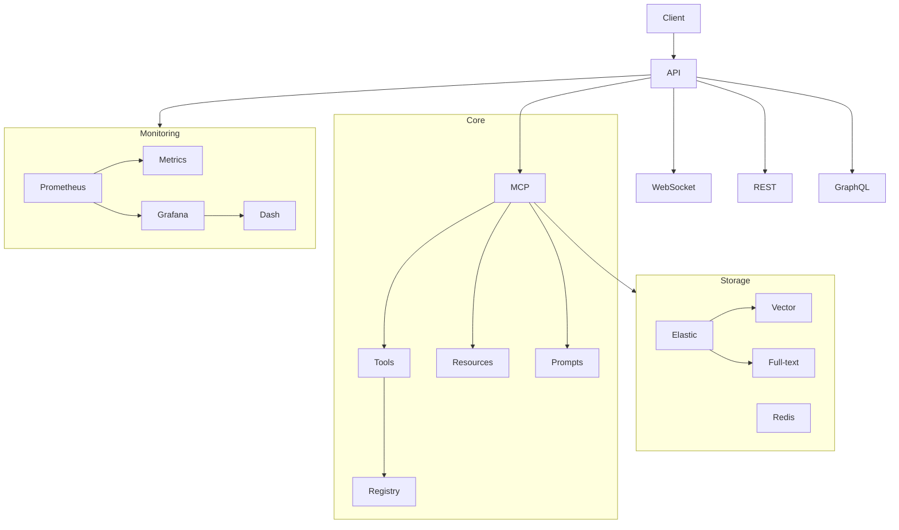

# MyAIServ Architecture

## System Architecture

## Component Description

### Core Components

1. **FastAPI Server**
   - Handles HTTP/WebSocket connections
   - Implements REST and GraphQL APIs
   - Manages authentication and request routing

2. **MCP Service**
   - Implements Model Context Protocol
   - Manages tools, resources, and prompts
   - Handles message sampling and processing

3. **Storage Layer**
   - Elasticsearch for vector and full-text search
   - Redis for caching and session management
   - Supports distributed deployment

### Monitoring & Observability

- Prometheus metrics collection
- Grafana dashboards for visualization
- Real-time system monitoring
- Custom alerts and notifications

### Key Features

- Modular architecture for easy extension
- Scalable microservices design
- High-performance async operations
- Comprehensive monitoring and logging