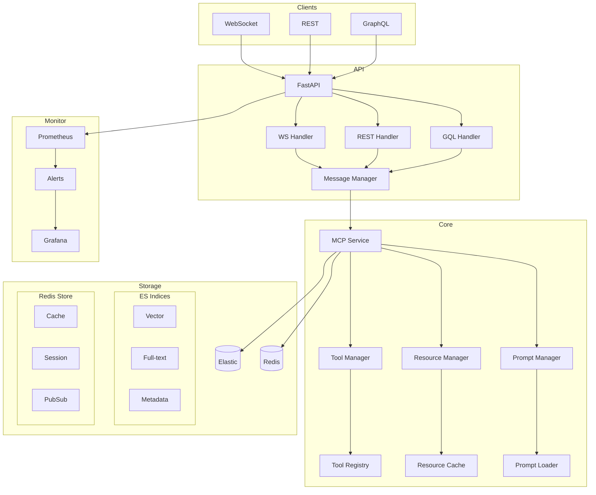

# Technical Architecture

## Data Flow Architecture



## Component Details

### API Gateway

- **FastAPI Server**: Main entry point handling all incoming requests
- **WebSocket Handler**: Manages real-time bidirectional communication
- **REST Handler**: Processes HTTP requests for REST API
- **GraphQL Handler**: Handles GraphQL queries and mutations

### MCP Core

- **MCP Service**: Core service implementing Model Context Protocol
- **Tool Manager**: Handles tool registration and execution
- **Resource Manager**: Manages resource loading and caching
- **Prompt Manager**: Processes and manages system/user prompts

### Storage Layer

- **Elasticsearch**:
  - Vector Index: For semantic search
  - Full-text Index: For text search
  - Metadata Index: For storing relationships
- **Redis**:
  - Cache Store: For fast data access
  - Session Store: For user sessions
  - Pub/Sub: For real-time updates

### Monitoring

- **Prometheus**: Metrics collection and alerting
- **Grafana**: Visualization and dashboards

### Development Tools

- **Poetry**: Package and dependency management
  - Handles virtual environment creation
  - Manages dependencies with precise versioning
  - Supports development vs production dependencies
  - Integrates with CI/CD pipeline
- **Just**: Task runner for common operations
  - Simplifies common development tasks
  - Standardizes commands across development environments

## Data Flow Sequence

1. Client sends request through WebSocket/REST/GraphQL
2. FastAPI routes request to appropriate handler
3. Message Manager processes and validates request
4. MCP Service executes requested operation
5. Results are stored in Elasticsearch/Redis
6. Response is sent back to client
7. Metrics are collected by Prometheus

## Development Environment Setup

The project uses Poetry for dependency management. This ensures consistent environments across development, testing, and production.

### Dependency Management

Dependencies are defined in `pyproject.toml` with exact versions to ensure reproducibility:

```toml
[tool.poetry.dependencies]
python = "^3.9"
fastapi = "^0.110.0"
uvicorn = "^0.27.1"
httpx = "^0.27.0"
# Additional dependencies...

[tool.poetry.group.dev.dependencies]
black = "24.2.0"
isort = "5.13.2"
flake8 = "7.0.0"
mypy = "1.8.0"
ruff = "0.3.0"
```

### Docker Integration

Poetry is integrated with our Docker build process to ensure that the same dependency versions are used in container environments.
