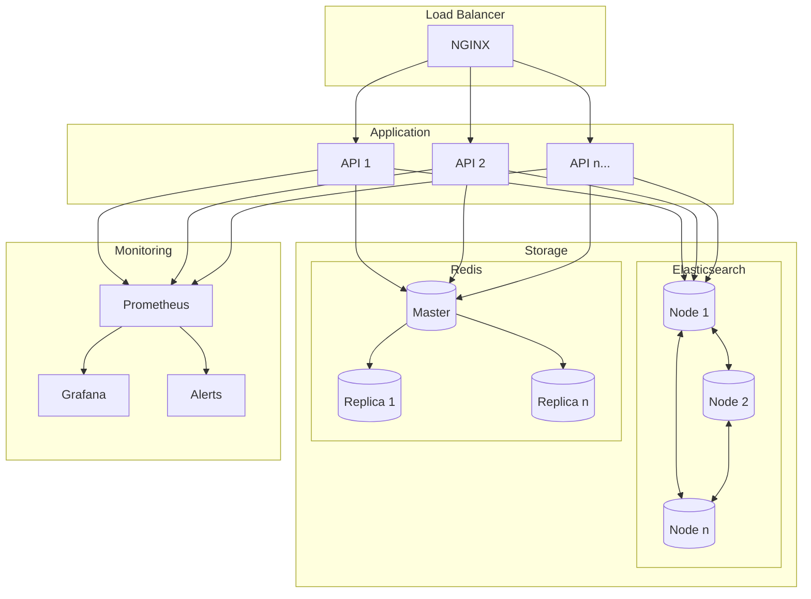

# Deployment Architecture

## Container Architecture

## Deployment Configuration

### Container Orchestration

- Kubernetes or Docker Swarm for container orchestration
- Automatic scaling based on load
- Health checks and auto-recovery
- Rolling updates with zero downtime

### High Availability

- Multiple API server instances
- Elasticsearch cluster with 3+ nodes
- Redis master-replica setup
- Load balancer with SSL termination

### Monitoring & Alerts

- Real-time metrics collection
- Custom Grafana dashboards
- Alert rules for critical conditions
- Automated incident response

### Backup & Recovery

- Automated Elasticsearch snapshots
- Redis persistence and backup
- Configuration backups
- Disaster recovery procedures

### Security

- SSL/TLS encryption
- Network isolation
- Access control lists
- Security monitoring

## Resource Requirements

### Minimum Production Setup

- **API Servers**: 2+ instances, 2 CPU, 4GB RAM each
- **Elasticsearch**: 3 nodes, 4 CPU, 8GB RAM each
- **Redis**: 1 master + 2 replicas, 2 CPU, 4GB RAM each
- **Monitoring**: 2 CPU, 4GB RAM
- **Storage**: 100GB+ per Elasticsearch node
