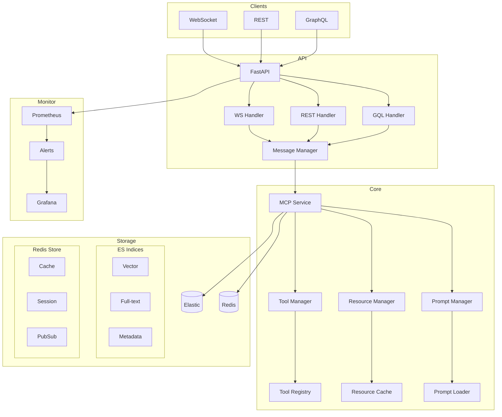

# Technical Architecture

## Data Flow Architecture

## Component Details

### API Gateway
- **FastAPI Server**: Main entry point handling all incoming requests
- **WebSocket Handler**: Manages real-time bidirectional communication
- **REST Handler**: Processes HTTP requests for REST API
- **GraphQL Handler**: Handles GraphQL queries and mutations

### MCP Core
- **MCP Service**: Core service implementing Model Context Protocol
- **Tool Manager**: Handles tool registration and execution
- **Resource Manager**: Manages resource loading and caching
- **Prompt Manager**: Processes and manages system/user prompts

### Storage Layer
- **Elasticsearch**:
  - Vector Index: For semantic search
  - Full-text Index: For text search
  - Metadata Index: For storing relationships
- **Redis**:
  - Cache Store: For fast data access
  - Session Store: For user sessions
  - Pub/Sub: For real-time updates

### Monitoring
- **Prometheus**: Metrics collection and alerting
- **Grafana**: Visualization and dashboards

## Data Flow Sequence

1. Client sends request through WebSocket/REST/GraphQL
2. FastAPI routes request to appropriate handler
3. Message Manager processes and validates request
4. MCP Service executes requested operation
5. Results are stored in Elasticsearch/Redis
6. Response is sent back to client
7. Metrics are collected by Prometheus